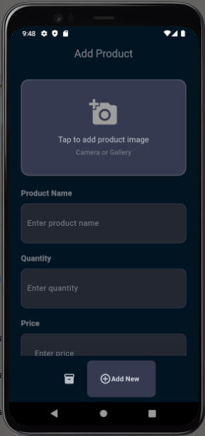
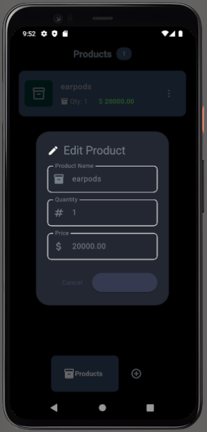
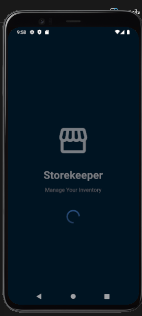

# 🏪 Storekeeper - Inventory Management App

A Flutter-based inventory management application that helps store owners manage their product inventory efficiently. Built with SQLite for local data persistence and native camera integration for product images.


## ✨ Features

- ✅ **Full CRUD Operations**: Create, Read, Update, and Delete products
- 📦 **Local Database**: SQLite implementation for reliable data persistence
- 📸 **Camera Integration**: Capture product images directly or choose from gallery
- 🖼️ **Image Management**: Persistent storage for product images
- 🎨 **Clean UI**: Modern dark-themed interface with smooth navigation
- 🔄 **Real-time Updates**: Provider state management for instant UI updates
- 📱 **Responsive Design**: Optimized for various screen sizes

## 📱 Screenshots

<table>
  <tr>
    <td></td>
    <td></td>
    <td></td>
    <td></td>
  </tr>
  <tr>
    <td align="center">Products List</td>
    <td align="center">Add Product</td>
    <td align="center">Edit Product</td>
    <td align="center">Splash Screen</td>
  </tr>
</table>

## 🎥 Demo Video

Watch the full app walkthrough: [Demo Video Link](https://drive.google.com/file/d/15DCY85PkOM1LLuMGZzLTWupBelFQo3NQ/view?usp=sharing)

## 📥 Download APK

Download the latest release: [Storekeeper v1.0.0](https://appetize.io/app/b_ec7gugls3gwvkw73fceipz5hfm)

## 🛠️ Tech Stack

- **Framework**: Flutter 3.x
- **Language**: Dart
- **Database**: SQLite (sqflite package)
- **State Management**: Provider
- **Image Handling**: image_picker, path_provider
- **UI Components**: Material Design 3

## 📦 Dependencies

```yaml
dependencies:
  flutter:
    sdk: flutter
  provider: ^6.1.1
  sqflite: ^2.3.0
  path: ^1.8.3
  image_picker: ^1.0.4
  path_provider: ^2.1.1
  google_nav_bar: ^5.0.6
  popover: ^0.3.0
```

## 🚀 Getting Started

### Prerequisites

- Flutter SDK (3.0.0 or higher)
- Dart SDK (3.0.0 or higher)
- Android Studio / VS Code
- Android Emulator or Physical Device

### Installation

1. **Clone the repository**

```bash
   git clone https://github.com/yourusername/storekeeper-app.git
   cd storekeeper-app
```

2. **Install dependencies**

```bash
   flutter pub get
```

3. **Run the app**

```bash
   flutter run
```

### Building APK

To build a release APK:

```bash
flutter build apk --release
```

The APK will be located at: `build/app/outputs/flutter-apk/app-release.apk`

## 📂 Project Structure

```
lib/
├── components/          # Reusable UI components
│   ├── my_button.dart
│   ├── my_nav_bar.dart
│   ├── my_textfield.dart
│   ├── product_tile.dart
│   └── settings.dart
├── model/              # Data models
│   └── product.dart
├── pages/              # App screens
│   ├── add_product_page.dart
│   ├── home_page.dart
│   ├── product_page.dart
│   └── splash_screen.dart
├── services/           # Business logic & services
│   ├── database/
│   │   ├── database_helper.dart
│   │   └── product_database.dart
│   └── theme/
│       └── dark_mode.dart
└── main.dart          # App entry point
```

## 💾 Database Schema

```sql
CREATE TABLE products (
  id INTEGER PRIMARY KEY AUTOINCREMENT,
  name TEXT NOT NULL,
  quantity REAL NOT NULL,
  price REAL NOT NULL,
  imagePath TEXT NOT NULL
);
```

## 🎯 Key Features Explained

### CRUD Operations

- **Create**: Add new products with name, quantity, price, and image
- **Read**: View all products in a scrollable list
- **Update**: Edit existing product details
- **Delete**: Remove products from inventory

### Camera Integration

- Capture images directly using device camera
- Select images from gallery
- Persistent image storage in app directory
- Automatic image path management

### State Management

Using Provider for efficient state management:

- Real-time UI updates
- Centralized data management
- Minimal rebuilds for better performance

## 🔧 Configuration

### Android Permissions

Ensure these permissions are in `android/app/src/main/AndroidManifest.xml`:

```xml
<uses-permission android:name="android.permission.CAMERA"/>
<uses-permission android:name="android.permission.READ_EXTERNAL_STORAGE"/>
<uses-permission android:name="android.permission.WRITE_EXTERNAL_STORAGE"/>
```

## 🐛 Known Issues

- Images may not load if app data is cleared (working on cloud storage integration)
- Camera permission must be granted on first use

## 🙏 Acknowledgments

- Flutter team for the amazing framework
- Material Design for UI guidelines
- The Flutter community for helpful packages

## 📞 Support

If you have any questions or run into issues, please:

1. Check existing [Issues](https://github.com/yourusername/storekeeper-app/issues)
2. Open a new issue with detailed description
3. Contact me directly via [nwankwoala3@gmail.com](mailto:nwankwoala3@gmail.com)

---

⭐ **Star this repo if you find it helpful!**

Made with ❤️ using Flutter
